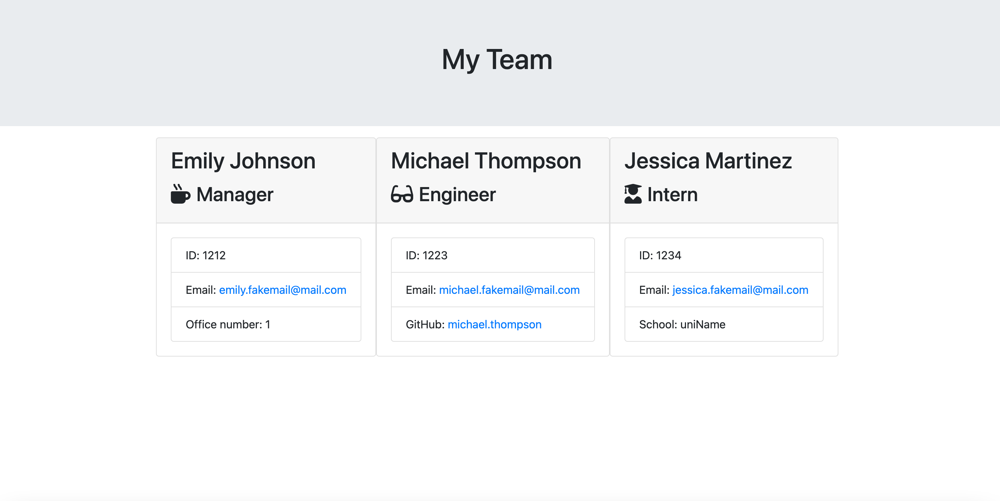

# Team Profile Generator

## Description

This project is a Node.js command-line application designed to generate an HTML webpage displaying summaries for each member of a software engineering team. The application collects information about team members, including managers, engineers, and interns, through a series of prompts. It then creates objects for each team member using appropriate classes as blueprints and generates an HTML file containing templated divs for each employee.

Screenshot to the html generated file:

## Installation

N/A

## Usage

This command-line tool guides users through the process of building a software engineering team profile. Here's how it works:

1. Start the application by opening the command-line tool and entering `node index.js`
2. Enter the team manager's details and hit enter:
   - Name
   - Employee ID
   - Email address
   - Office number
3. Choose from the following options:
   - Add an engineer: Enter details for an engineer, including name, ID, email, and GitHub username.
   - Add an intern: Enter details for an intern, including name, ID, email, and school.
   - Finish building the team: Exit the application and generate the HTML file.
4. After finishing the team setup, the HTML file is generated and saved in the output folder as \`team.html\`.

## Credit

The development of this project involved leveraging ChatGPT.

## License

This application is under the MIT license.
